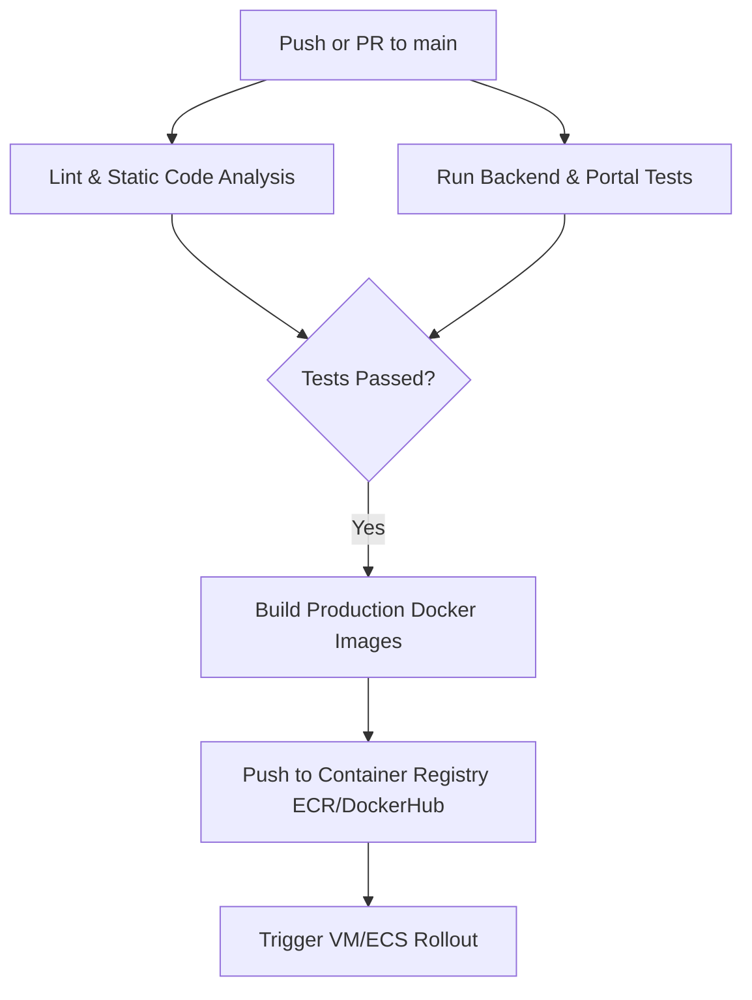

# CI/CD Pipeline - Amar Hospital

This document details the configuration for the automated CI/CD pipeline using **GitHub Actions** to lint, test, build, and deploy the application.

---

## Workflow Overview

The pipeline executes on two conditions:
1. **Pull Requests** to the `main` or `develop` branch (performs testing and linting).
2. **Push to main** (triggers tests, builds Docker images, publishes to a registry, and deploys to the environment).



---

## GitHub Actions Configuration

Create a file at `.github/workflows/deploy.yml`:

```yaml
name: CI/CD Pipeline

on:
  push:
    branches: [ main ]
  pull_request:
    branches: [ main ]

jobs:
  test-and-lint:
    runs-on: ubuntu-latest
    steps:
      - name: Checkout Code
        uses: actions/checkout@v3

      - name: Install Node.js
        uses: actions/setup-node@v3
        with:
          node-node: '18'
          cache: 'npm'
          cache-dependency-path: |
            backend/package-lock.json
            portal/package-lock.json

      # Backend Checks
      - name: Install Backend Deps
        run: npm ci --prefix backend

      - name: Lint Backend
        run: npm run lint --prefix backend

      - name: Test Backend
        run: npm run test --prefix backend

      # Web Portal Checks
      - name: Install Portal Deps
        run: npm ci --prefix portal

      - name: Build Web Portal (Verify compile)
        run: npm run build --prefix portal

  build-and-deploy:
    needs: test-and-lint
    if: github.ref == 'refs/heads/main' && github.event_name == 'push'
    runs-on: ubuntu-latest
    steps:
      - name: Checkout Code
        uses: actions/checkout@v3

      - name: Set up Docker Buildx
        uses: docker/setup-buildx-action@v2

      - name: Login to Docker Hub
        uses: docker/login-action@v2
        with:
          username: ${{ secrets.DOCKERHUB_USERNAME }}
          password: ${{ secrets.DOCKERHUB_TOKEN }}

      - name: Build and Push Backend
        uses: docker/build-push-action@v4
        with:
          context: ./backend
          push: true
          tags: ${{ secrets.DOCKERHUB_USERNAME }}/amar-backend:latest

      - name: Build and Push Portal
        uses: docker/build-push-action@v4
        with:
          context: ./portal
          push: true
          tags: ${{ secrets.DOCKERHUB_USERNAME }}/amar-portal:latest

      - name: SSH Deploy to VM
        uses: appleboy/ssh-action@master
        with:
          host: ${{ secrets.DEPLOY_HOST }}
          username: ${{ secrets.DEPLOY_USER }}
          key: ${{ secrets.DEPLOY_SSH_KEY }}
          script: |
            cd /opt/amar-hospital/clinic-app
            docker compose pull
            docker compose up -d
            docker system prune -f
```

---

## Deployment Configuration Secrets

To run this pipeline, configure the following secrets under **Settings > Secrets and variables > Actions**:
* `DOCKERHUB_USERNAME`: Docker Registry Username.
* `DOCKERHUB_TOKEN`: Docker Registry access token or password.
* `DEPLOY_HOST`: IP/Domain of the production VM.
* `DEPLOY_USER`: SSH login username (e.g., `ubuntu`).
* `DEPLOY_SSH_KEY`: Private SSH key matching the public key on the VM.
